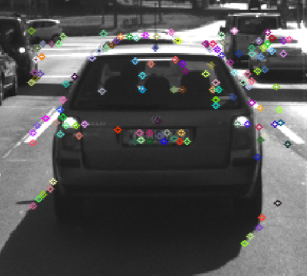

# Camera Based 2D Feature Tracking Project

This project intends to set up a feature detection and feature matching pipeline. In order to achieve this,
the following tasks were completed:

## Task 1: Data Buffer Optimization

A simple ringbuffer structure was implemented to limit the amount of memory taken up by the received images. 
The data structure is based on std::deque for sake of a concise implementation (instead of a std::array based solution where the read and write indices have to be tracked):

```cpp
template <class T, std::size_t capacity>
class Ringbuffer {
    std::deque<T> buffer;

   public:
    void push_back(const T& data) {
        buffer.push_back(data);
        if (buffer.size() > capacity) {
            buffer.pop_front();
        }
    }

    bool empty() const {
        return buffer.empty();
    }

    std::size_t size() const {
        return buffer.size();
    }

    typename std::deque<T>::iterator begin() {
        return buffer.begin();
    }

    typename std::deque<T>::iterator end() {
        return buffer.end();
    }

    T& back() {
        return buffer.back();
    }
};
```

## Task 2: Keypoint Detection

FAST, BRISK, ORB, AKAZE, and SIFT detectors where added and can be selected via an std::string:

```cpp
if (detectorType == "FAST") {
    int threshold = 30;
    bool bNMS = true;
    cv::FastFeatureDetector::DetectorType type = cv::FastFeatureDetector::TYPE_9_16;
    detector = cv::FastFeatureDetector::create(threshold, bNMS, type);
} else if (detectorType == "BRISK") {
    detector = cv::BRISK::create();
} else if (detectorType == "ORB") {
    detector = cv::ORB::create();
} else if (detectorType == "AKAZE") {
    detector = cv::AKAZE::create();
} else if (detectorType == "SIFT") {
    detector = cv::SIFT::create();
} else {
    std::cout << "Detector Type not found." << std::endl;
    return;
}
```

The Harris detector code was copied from the course material (see *detKeypointsHarris* in matching2D_Student.cpp).


## Task 3: Keypoint Removal

A filter was set up to filter out keypoints belonging to the preceding car:

```cpp
bool bFocusOnVehicle = true;
cv::Rect vehicleRect(535, 180, 180, 150);
if (bFocusOnVehicle) {
    std::vector<cv::KeyPoint> selected_keypoints;
    for (const auto& keypoint : keypoints) {
        if (vehicleRect.contains(keypoint.pt)) {
            selected_keypoints.push_back(keypoint);
        }
    }
    keypoints = selected_keypoints;
}
```


## Task 4: Keypoint Descriptors

Similar to task 2 a string based selection for descriptor types was added: 

```cpp
if (descriptorType == "BRISK") {
    int threshold = 30;
    int octaves = 3;
    float patternScale = 1.0f;

    extractor = cv::BRISK::create(threshold, octaves, patternScale);
} else if (descriptorType == "BRIEF") {
    extractor = cv::xfeatures2d::BriefDescriptorExtractor::create();
} else if (descriptorType == "ORB") {
    extractor = cv::ORB::create();
} else if (descriptorType == "FREAK") {
    extractor = cv::xfeatures2d::FREAK::create();
} else if (descriptorType == "AKAZE") {
    extractor = cv::AKAZE::create();
} else if (descriptorType == "SIFT") {
    extractor = cv::SIFT::create();
}
else {
    std::cout << "Descriptor " << descriptorType << " not found." << std::endl;
    return;
}
```


## Task 5: Descriptor Matching

The *matchDescriptors* function was extended to allow FLANN matching


```cpp
if (matcherType.compare("MAT_BF") == 0) {
    int normType = cv::NORM_HAMMING;
    if (descriptorType == "SIFT") {
        normType = cv::NORM_L2;
    }
    matcher = cv::BFMatcher::create(normType, crossCheck);
} else if (matcherType.compare("MAT_FLANN") == 0) {
    // OpenCV bug workaround : convert binary descriptors to floating point due to a bug in current OpenCV implementation
    if (descSource.type() != CV_32F) {
        descSource.convertTo(descSource, CV_32F);
    }
    if (descRef.type() != CV_32F) {
        descRef.convertTo(descRef, CV_32F);
    }
    matcher = cv::DescriptorMatcher::create(cv::DescriptorMatcher::FLANNBASED);
}
```

## Task 6: Descriptor Matching

At last the keypoint were filtered using the descriptor distance ratio test:
```cpp
double minDescDistRatio = 0.8;
for (auto it = knn_matches.begin(); it != knn_matches.end(); ++it) {
    if ((*it)[0].distance < minDescDistRatio * (*it)[1].distance) {
        matches.push_back((*it)[0]);
    }
}
```

## Task 7: Performance Evaluation Keypoint Detection

In this task the average number of detected keypoint on the preceding car is compared over a variety of detectors:

| Detector       | Avg. number of keypoints | Image                                                          |
| -----------    |  ---:                    | ---                                                            |
| SHITOMASI      | 117                      |       |
| HARRIS         | 24                       |          |
| FAST           | 149                      |            |
| BRISK          | 276                      |           |
| ORB            | 116                      |             |
| AKAZE          | 167                      |           |
| SIFT           | 138                      |            |

The main takeway here is that the HARRIS detector only finds very crude keypoints like light spots. Even tuning of the Harris parameters did not 
improve this by much. BRISK, AKAZE and SIFT have the most notable detection clusters on the edges of the car.


## Task 8: Performance Evaluation Keypoint Matching

Number of matched keypoints for all detector/descriptor pairs with KNN matching and brute force selection:

| Detectors/Descriptors    | BRISK         | BRIEF         | ORB           | FREAK         | AKAZE         | SIFT          |
| -----------              |  ---:         |  ---:         |  ---:         |  ---:         |  ---:         |  ---:         |
| SHITOMASI                | 85            |  104          |  100          |   85          |  FAILED       |  103          |
| HARRIS                   | 15            |   19          |   17          |   16          |  FAILED       |   18          |
| FAST                     | 99            |  122          |  120          |   97          |  FAILED       |  116          |
| BRISK                    | 174           |  189          |  167          |  169          |  FAILED       |  182          |
| ORB                      |  83           |   60          |   84          |   46          |  FAILED       |  116          |
| AKAZE                    | 135           |  140          |  131          |  132          |  139          |  141          |
| SIFT                     |  65           |   78          |  out of memory|   66          |  FAILED       |   88          |


## Task 9: Performance Evaluation Timing

Time for keypoint detection and descriptor extraction per image in ms:

| Detectors/Descriptors    | BRISK         | BRIEF         | ORB           | FREAK         | AKAZE         | SIFT          |
| -----------              |  ---:         |  ---:         |  ---:         |  ---:         |  ---:         |  ---:         |
| SHITOMASI                | 13.4          |  13.4         |  12.3         |   36.3        |  FAILED       |  24.6         |
| HARRIS                   | 15.3          |  14.5         |  13.4         |   40.9        |  FAILED       |  28.9         |
| FAST                     |  3.1          |   1.8         |   1.7         |   33.0        |  FAILED       |  15.8         |
| BRISK                    | 37.1          |  34.2         |  37.2         |   61.5        |  FAILED       |  56.1         |
| ORB                      | 17.8          |  16.3         |  22.5         |   45.4        |  FAILED       |  36.9         |
| AKAZE                    | 54.9          |  48.5         |  55.4         |   79.2        |  93.3         |  70.0         |
| SIFT                     | 82.5          |  72.4         |  out of memory|   94.9        |  FAILED       | 117.0         |

FAST is without a doubt the fastest detector out of all options. Combined with BRIEF it seems to optimize the number of matches per ms.
In terms of maximum detections the BRISK-BRIEF combination seems to be the best if we accept a significant increase in processing time.